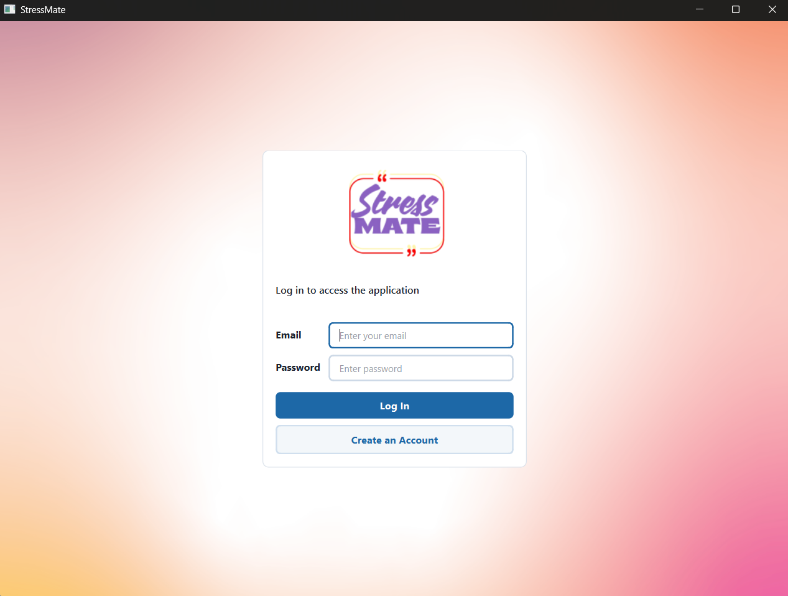
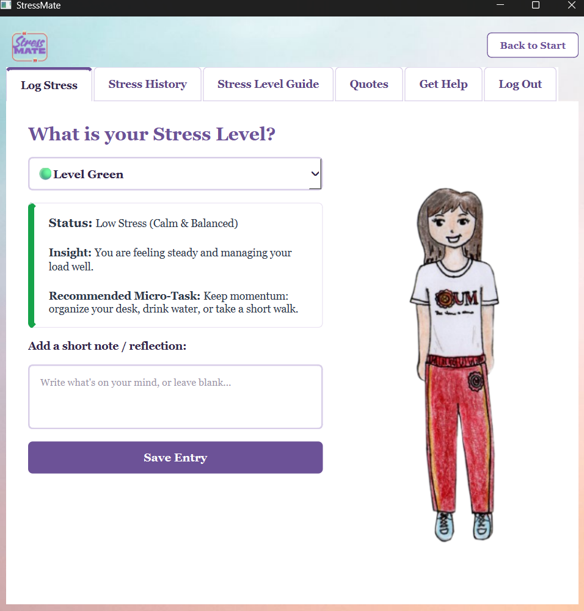
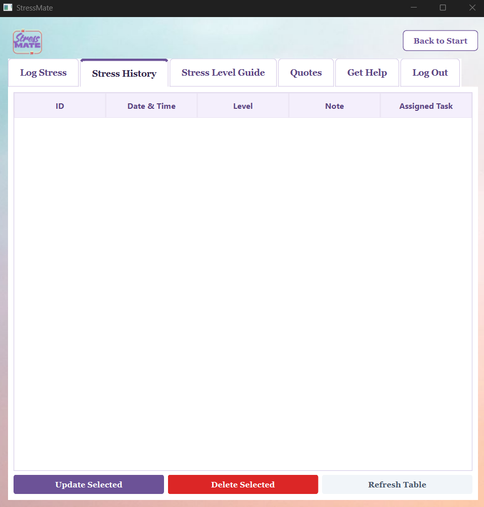

# StressMate: Stress Tracker

## Project Description
StressMate is an interactive application designed to help users track their daily stress levels, reflect on their emotions through journaling, and receive actionable coping strategies tailored to their current mental state. 

With the increasing demands of academic and professional life, many individuals experience burnout and anxiety without knowing how to pause or manage it. StressMate provides an organized space to log feelings and offering instant grounding techniques (like the 4-7-8 breathing method or micro-tasks) to intercept extreme stress before it escalates.

## Project Objectives
* To provide daily stress logging and emotional reflection.
* To offer actionable advice and micro-tasks dynamically tailored to the user's specific stress tier (Green, Yellow, Orange, Red).
* To maintain a secure database of user accounts and their emotional history, allowing users to look back and manage their well-being over time.

## Features
* **Secure User Authentication:** A robust login and registration system featuring strict password validation (minimum length, uppercase, and numerical requirements) and secure SHA-256 password hashing.
* **Interactive Stress Logging:** Users can categorize their current stress into four color-coded tiers and add personal reflection notes to record their daily mental state.
* **History Management (CRUD):** Users can seamlessly view, update, and delete their past stress logs in a structured data table.
* **Coping & Support Resources:** Dedicated informative modules broken down into Physical, Emotional, and Spiritual help, providing specific grounding techniques and actionable advice.
* **Inspirational Quotes Album:** An interactive image gallery providing users with uplifting quotes and visual encouragement.

## Technologies Used
* **Programming Language:** Python 3
* **GUI Framework:** PyQt6
* **Database:** SQLite (via the built-in `sqlite3` module)
* **Other Important Libraries:**
  * `hashlib`: For secure password hashing.
  * `re` (RegEx): For validating email formats and strict password rules.
  * `dataclasses`: For structuring clean, object-oriented domain models.
  * `os`: For dynamic and safe asset file path routing.

## Project Structure
* **`/assets/`**: Stores all static media resources, including the application logo, background images, overview infographics, and the quotes image gallery.
* **`/database/`**: Contains `database.py`, which encapsulates the SQLite connection logic and automatically executes the schema creation for the `users` and `stress_logs` tables.
* **`/features/`**: The core directory utilizing a layered Object-Oriented Programming (OOP) architecture. It is divided into two main domains: `authentication` and `tracker`.
  * Inside each feature, the code is cleanly separated into `model.py` (data structures), `repository.py` (database queries), `service.py` (business logic and validation), and `view.py` (PyQt6 UI rendering).
* **`main.py`**: The central entry point and orchestrator of the application. It initializes the database, connects the services, and uses a `QStackedWidget` to manage screen transitions.
## 7. Installation and Setup
**Dependencies:** 
* `PyQt6`[cite: 14]

**Steps to Run:**[cite: 14]
1. Clone the repository to your local machine.
2. Open a terminal in the project folder.
3. Install PyQt6 by running: `pip install PyQt6`
4. Run the application: `python main.py`

## 8. How to Use the System
1. **Register/Login:** Create a secure account or log in.[cite: 14]
2. **Dashboard:** Click "HOW ARE YOU FEELING TODAY?" to enter the tracker.[cite: 14]
3. **Log Stress:** Select your current stress level, add an optional reflection note, and save.[cite: 14]
4. **View History:** Navigate to the History tab to Update or Delete past entries.[cite: 14]
5. **Get Support:** Use the Guides, Quotes, and Help tabs for grounding exercises.[cite: 14]

## 9. OOP Implementation
* **Important Classes:** `User`, `StressRecord` (Models), `AuthService`, `StressService` (Logic), and `TrackerView` (UI)[cite: 14].
* **Encapsulation:** Database connections and sensitive logic are hidden inside Repository and Service classes, protecting the data from direct manipulation by the UI[cite: 14].
* **Inheritance:** Our view classes (e.g., `TrackerView`, `AuthView`) inherit from PyQt6’s base `QWidget` and `QMainWindow` classes to acquire window behaviors[cite: 14].
* **Polymorphism:** We override default PyQt6 initialization methods (like `__init__`) to inject our own custom UI designs and layouts[cite: 14].

## 10. Database
* **Structure:** A lightweight, relational SQLite database (`stressmate.db`)[cite: 14].
* **Important Tables:**[cite: 14]
  * `users` (Stores `id`, `email`, and hashed `password`).
  * `stress_logs` (Stores `id`, `user_id`, `timestamp`, `level_code`, `note`, and `task`).
* **Major Operations (CRUD):**[cite: 14]
  * **Create:** Registering new users and adding new stress logs.
  * **Read:** Verifying login credentials and fetching user history.
  * **Update:** Editing a previous stress reflection note or level.
  * **Delete:** Removing a stress log from the history table.

## 11. Screenshots
*  - The secure authentication screen.
*  - The main stress logging dashboard.
*  - The data table showing CRUD operations.

## 12. Testing
* **Test 1: Password Validation**[cite: 14]
  * *Expected:* System rejects passwords under 7 characters or missing uppercase/numbers. 
  * *Actual:* App successfully blocks registration and pops up a Warning Dialog.
* **Test 2: Database Retrieval**[cite: 14]
  * *Expected:* When saving a log, it appears immediately in the History Table.
  * *Actual:* The table dynamically refreshes and shows the new Create operation instantly.

## 13. Known Issues / Limitations
* **Local Storage:** The database currently runs locally via SQLite, meaning data is not synced across multiple devices via the cloud[cite: 14].
* **No Password Reset:** Users cannot currently recover a forgotten password through email verification[cite: 14].

## 14. Author
* **Name:** Hannah Galabo[cite: 14]
* **Section:** CS26L - 3581